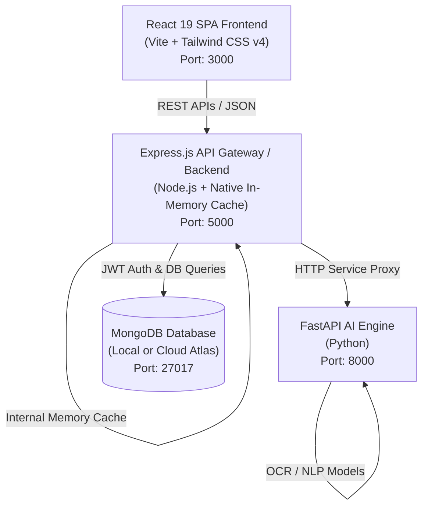

# 🏥 IntelliCare AI — Smart Healthcare & Hospital Management Platform (Native & Standalone)


**IntelliCare AI** is an intelligent, multi-service healthcare ecosystem and hospital management system (HMS). Powered by artificial intelligence, automated Optical Character Recognition (OCR), medical report summarizers, drug interaction engines, and role-tailored dashboards, IntelliCare AI connects patients, doctors, laboratories, pharmacies, and hospital administrators in a unified digital platform.

> [!NOTE]
> **Standalone Native Architecture**: This project is optimized to run **natively on your machine without requiring Docker or a Redis server**. It uses Node.js, Python FastAPI, React, and MongoDB directly with zero-dependency native caching.

---

## 📑 Table of Contents

- [Architectural Overview](#-architectural-overview)
- [Key Features](#-key-features)
- [Role-Based Dashboards](#-role-based-dashboards)
- [AI Engine Capabilities & Endpoints](#-ai-engine-capabilities--endpoints)
- [Backend REST API Reference](#-backend-rest-api-reference)
- [Repository Structure](#-repository-structure)
- [Prerequisites](#-prerequisites)
- [🚀 Quick Start (One-Click Launcher)](#-quick-start-one-click-launcher)
- [🛠️ Step-by-Step Manual Setup](#️-step-by-step-manual-setup)
- [Environment Variables](#-environment-variables)
- [Verification & Health Checks](#-verification--health-checks)
- [License](#-license)

---

## 🏗️ Architectural Overview

IntelliCare AI runs as three lightweight native microservices:



### Component Breakdown

| Service | Technology Stack | Port | Description |
| :--- | :--- | :--- | :--- |
| **Frontend** | React 19, Vite, Redux Toolkit, Tailwind CSS v4, Chart.js, Lucide | `3000` | Single Page Application with dynamic role-based dashboards |
| **Backend API** | Node.js, Express.js, Mongoose, JWT, Multer | `5000` | Core REST API with built-in native in-memory caching |
| **AI Engine** | Python 3.10+, FastAPI, Pydantic, Uvicorn, NumPy, Pandas | `8000` | Dedicated AI engine for OCR, medical NLP & triage |
| **Database** | MongoDB (Community or Atlas) | `27017` | Persistent document database |

---

## ✨ Key Features

- 🧾 **Prescription OCR Parser**: Upload prescription images to extract medicine names, dosages, and usage frequencies automatically.
- 🩸 **Plain-Language Report Summarizer**: Translates complex blood, pathology, and scan reports into clear patient-friendly insights.
- 🕒 **Chronological Health Timeline**: Generates a unified interactive timeline of medical diagnoses, treatments, and doctor visits.
- 🩺 **Automated Symptom Triage**: Provides self-care guidance and urgency assessments based on user symptoms.
- ⚠️ **Drug Interaction Engine**: Analyzes medication lists to flag potential drug-drug conflicts.
- 🥗 **AI Lifestyle & Nutrition Coaches**: Personalizes meal plans and exercise guidance according to physical metrics (BMI, BP, sugar).
- 💬 **Contextual Medical Assistant**: Multi-turn AI assistant capable of answering user health queries with profile context.

---

## 👥 Role-Based Dashboards

IntelliCare AI supports 6 distinct user access roles:

1. **🧑‍🦽 Patient**: View EHR timeline, lab report summaries, schedule appointments, check drug interactions, access nutrition plans, and consult the AI assistant.
2. **👨‍⚕️ Doctor**: View assigned patients, access medical histories, issue digital prescriptions, order lab tests, and manage clinical schedules.
3. **🔬 Laboratory Technician**: Manage incoming test requests, input lab findings, generate electronic reports, and update diagnostic status.
4. **💊 Pharmacist**: Fulfill digital prescriptions, manage pharmaceutical inventory, track low-stock items, and verify dosages.
5. **🏢 Hospital Administrator**: Track hospital metrics, department occupancy, revenue, staff workloads, and inventory workflows.
6. **🛡️ System Administrator**: Manage user roles, system settings, access permissions, security, and platform audit logs.

---

## 🤖 AI Engine Capabilities & Endpoints

The **FastAPI AI Microservice** (`ai_service`) exposes dedicated machine learning and NLP endpoints:

| Endpoint | Method | Input Description | Output / Function |
| :--- | :--- | :--- | :--- |
| `/ai/ocr` | `POST` | Image upload (`multipart/form-data`) | Extracted medicines, dosage, & usage frequency |
| `/ai/summarize` | `POST` | Raw lab report text (`JSON`) | Plain-language summary & key metric breakdown |
| `/ai/timeline` | `POST` | List of medical events (`JSON`) | Chronologically sorted & categorized medical timeline |
| `/ai/symptoms` | `POST` | Symptom description (`JSON`) | Triage level (Low/Med/High) & home care guidelines |
| `/ai/interactions` | `POST` | Array of medicine names (`JSON`) | Severity breakdown & conflict alerts |
| `/ai/lifestyle` | `POST` | Metrics: BMI, BP, sugar, activity (`JSON`) | Personalized exercise & cardiovascular advice |
| `/ai/nutrition` | `POST` | Dietary preferences & health conditions | Tailored weekly meal plan & restriction list |
| `/ai/chat` | `POST` | User query + optional health profile | Context-aware AI health responses |

---

## 🔌 Backend REST API Reference

The **Express Backend** (`backend`) acts as the primary API server:

- **Authentication (`/api/auth`)**: User signup, login, JWT verification, and profile management.
- **Patients (`/api/patients`)**: EHR history, personal demographics, and health metric tracking.
- **Appointments (`/api/appointments`)**: Slot booking, status updates (Pending/Approved/Completed), and calendar views.
- **Doctors (`/api/doctors`)**: Doctor listings, specialties, availability schedules, and consultation notes.
- **Reports (`/api/reports`)**: Lab report upload via Multer, PDF/image storage, and automated AI summary triggering.
- **Inventory (`/api/inventory`)**: Pharmacy stock levels, medicine batch tracking, reorder alerts.
- **Admin (`/api/admin`)**: System metrics, user management, and hospital activity analytics.

---

## 📁 Repository Structure

```
IntelliCare-AI/
├── start.bat                   # One-click Windows batch script launcher
├── start.ps1                   # PowerShell native launcher script
│
├── ai_service/                 # FastAPI AI Microservice
│   ├── services/               # AI module handlers (OCR, NLP, Triage, Chat)
│   │   ├── assistant.py        # AI Chatbot module
│   │   ├── coaches.py          # Lifestyle & Nutrition advice engine
│   │   ├── interactions.py     # Drug-drug interaction checker
│   │   ├── ocr_engine.py       # Prescription image processing (OCR)
│   │   ├── summarizer.py       # Medical report plain-language summarizer
│   │   ├── symptoms.py         # Symptom triage analyzer
│   │   └── timeline.py         # Chronological event timeline builder
│   ├── main.py                 # FastAPI application routes
│   └── requirements.txt        # Python dependencies
│
├── backend/                    # Express.js REST API Gateway
│   ├── config/                 # Database (Mongoose) & native in-memory cache
│   │   ├── db.js               # MongoDB connection & seeder
│   │   └── redis.js            # Standalone zero-dependency cache module
│   ├── middleware/             # Auth JWT, Role RBAC, and error handlers
│   ├── models/                 # Mongoose schemas (User, Patient, Appointment, Report, etc.)
│   ├── public/uploads/         # Uploaded report files & images
│   ├── routes/                 # Express API routes (Auth, Patients, Reports, Admin)
│   ├── package.json            # Node.js backend dependencies
│   └── server.js               # Express application entry point
│
└── frontend/                   # React 19 Single Page Application
    ├── src/
    │   ├── components/         # Reusable UI components (Navbar, Modals, Cards)
    │   ├── context/            # Global App state & Context providers
    │   ├── pages/              # Role-specific dashboard views
    │   │   ├── Dashboard.jsx               # Dashboard router controller
    │   │   ├── DoctorDashboard.jsx         # Physician view
    │   │   ├── HospitalAdminDashboard.jsx  # Hospital management view
    │   │   ├── LaboratoryDashboard.jsx     # Lab tech view
    │   │   ├── LandingPage.jsx             # Public portal landing page
    │   │   ├── Login.jsx                   # Role authentication page
    │   │   ├── PatientDashboard.jsx        # Patient health portal
    │   │   ├── PharmacyDashboard.jsx       # Pharmacist inventory view
    │   │   └── SystemAdminDashboard.jsx    # System configuration view
    │   ├── App.jsx             # Main routing & layout structure
    │   ├── main.jsx            # React root DOM renderer
    │   └── index.css           # Tailwind CSS styles & design tokens
    ├── package.json            # Frontend Vite & React dependencies
    ├── tailwind.config.js      # Tailwind styling configuration
    └── vite.config.js          # Vite build settings
```

---

## ⚡ Prerequisites

To run this project natively on your computer, ensure you have:

1. **Node.js** (v18.0 or higher) & **npm**
2. **Python** (v3.10 or higher) & **pip**
3. **MongoDB** (Local MongoDB Server running on port `27017` or a cloud [MongoDB Atlas](https://www.mongodb.com/cloud/atlas) URI)

*(No Docker installation or Redis service required!)*

---

## 🚀 Quick Start (One-Click Launcher)

### On Windows

1. **Start MongoDB**: Ensure your local MongoDB service is running (or set your MongoDB Atlas connection string in `backend/.env`).
2. **Double-click `start.bat`** (or open terminal and run `.\start.bat`).

This script automatically launches all 3 microservices concurrently in separate command windows:
- **Frontend App**: [http://localhost:3000](http://localhost:3000)
- **Express Backend**: [http://localhost:5000](http://localhost:5000)
- **FastAPI AI Engine**: [http://localhost:8000](http://localhost:8000)

---

## 🛠️ Step-by-Step Manual Setup

If you prefer to start each service manually:

### 1. Backend Setup
```bash
cd backend
npm install
npm run seed     # Optional: Seed sample database records into MongoDB
npm run dev      # Runs Express server on port 5000
```

### 2. AI Engine Setup
```bash
cd ai_service
pip install -r requirements.txt
python main.py   # Runs FastAPI server on port 8000
```

### 3. Frontend Setup
```bash
cd frontend
npm install
npm run dev      # Runs Vite dev server on port 3000
```

---

## 🔑 Environment Variables

### Backend (`backend/.env`)
```env
PORT=5000
MONGO_URI=mongodb://127.0.0.1:27017/intellicare
JWT_SECRET=intellicare_super_secret_key_2026_jwt_token_auth
AI_SERVICE_URL=http://localhost:8000
NODE_ENV=development
```

### AI Microservice (`ai_service/.env`)
```env
PORT=8000
HOST=0.0.0.0
```

---

## 🔍 Verification & Health Checks

Once the services are running, verify each endpoint in your browser or terminal:

1. **Backend Health Check**:
   ```bash
   curl http://localhost:5000/
   # Output: {"status":"success","message":"IntelliCare AI Express Backend is running successfully"}
   ```

2. **AI Engine Health Check**:
   ```bash
   curl http://localhost:8000/
   # Output: {"status":"IntelliCare AI Service is running successfully"}
   ```

3. **Interactive AI API Docs**:
   Open [http://localhost:8000/docs](http://localhost:8000/docs) for FastAPI Swagger UI.

4. **Frontend App**:
   Open [http://localhost:3000](http://localhost:3000) to view the portal.

---

## 📄 License

Distributed under the **MIT License**.
